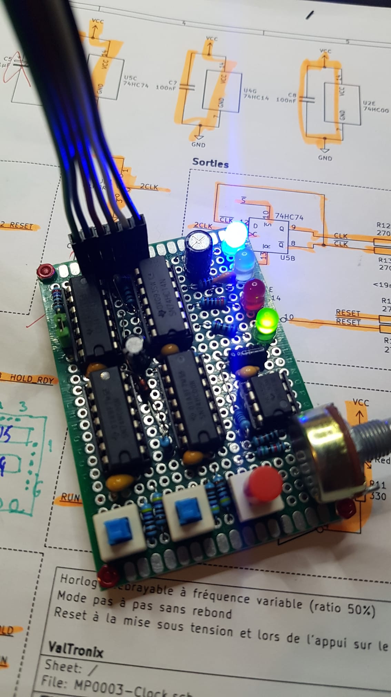
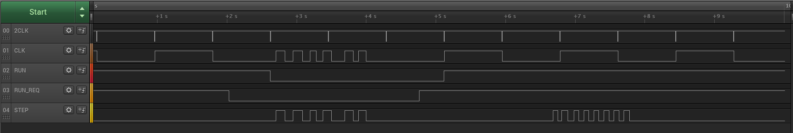

# MP0003 Clock
Mini-plaquette permettant de générer un signal d'horloge débrayable.
La fréquence est variable entre environ 1Hz et 44Hz mais conserve un ratio de 50%.
Le signal d'horloge est disponible simultanément en logique positive et négative.
Ce signal d'horloge peut être mis en pause et repris de façon propre sans introduire d'impulsions parasites.
Lorsqu'il est en pause (hold) il est possible d'envoyer des impulsions manuellement sans rebond (mode pas-à-pas).

Parallèlement à l'horloge, un signal RESET et son complément sont disponibles.
Le RESET est activé par défaut à la mise sous tension et à chaque appui sur le bouton RESET.
Une durée minimale d'impulsion est garantie.

Le RESET, les tops d'horloge et le mode "run" (horloge active) sont affichés via des LED:
 - LED bleue: alimentation (ON)
 - LED jaune: tops d'horloge
 - LED rouge: RESET
 - LED verte: mode RUN (éteint: mode pas-à-pas)

Les sorties sont protégées contre les courts-circuits et l'alimentation est protégée contre l'inversion de polarité.

Mon article de blog complet sur ce projet est accessible dans [l'antre de ValTronix](https://valtronix.com/index.php/23-realisations/mini-plaquettes/50-mp0003-horloge-a-frequence-variable-avec-mode-pas-a-pas).

Ma réalisation sur protoboard:

Le brochage de sortie sur ma protoboard est (dans le sens de la photo, de gauche à droite):
 1. VCC
 2. CLK (actif haut)
 3. !CLK (actif bas)
 4. RESET (actif haut)
 5. !RESET (actif bas)
 6. GND

Exemple de diagramme de temps:

